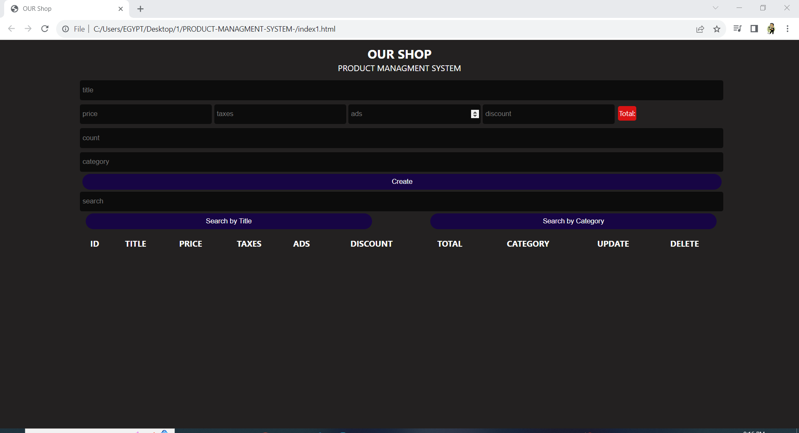
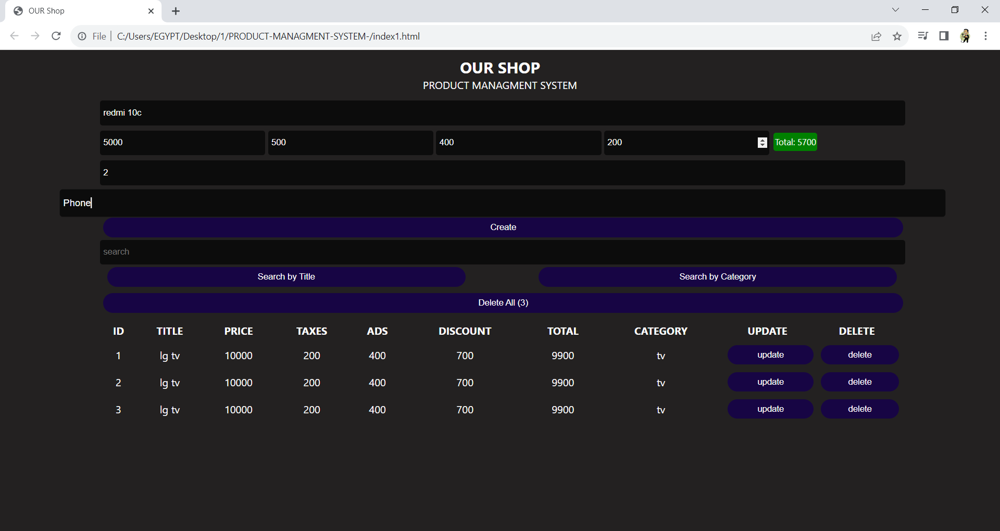
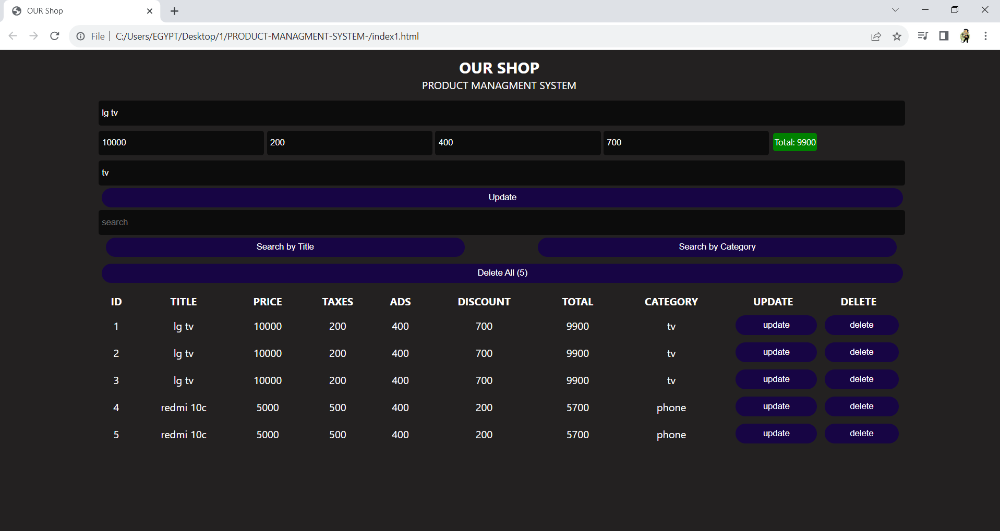

# CRUDS frontend project
# Introduction:
 A user‑friendly website tailored for efficient product management, enabling users to effortlessly add, update, delete specific products, or clear the entire product database. The platform provides a comprehensive interface for inputting essential product details, including name, price,
taxes, discounts, and quantity
# Technologies Used:
- HTML5
- CSS3
- JavaScript

# Usage:

It covers Database CRUD operations.

# Live video:

[Live video]([URL](https://www.linkedin.com/posts/amr-gebil-557a9024a_webabrdeveloper-django-djangoabrdeveloper-activity-7094657759098368001-xZPV?utm_source=share&utm_medium=member_desktop)https://www.linkedin.com/posts/amr-gebil-557a9024a_webabrdeveloper-django-djangoabrdeveloper-activity-7094657759098368001-xZPV?utm_source=share&utm_medium=member_desktop)

# Screenshots:

